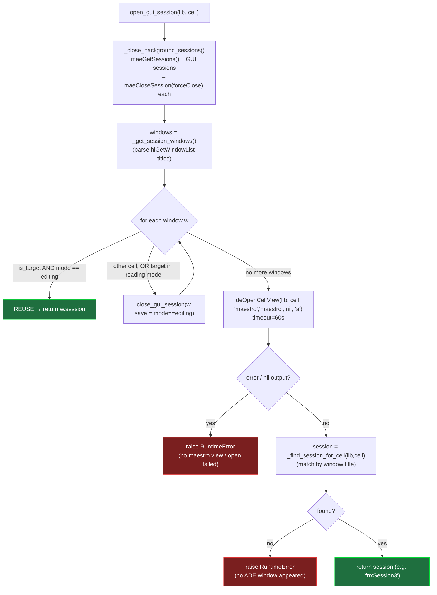
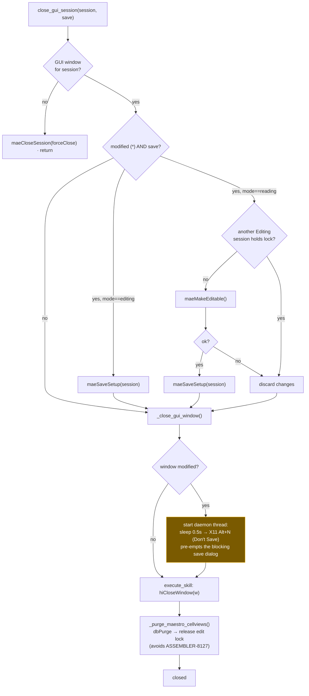

# Maestro Session State Machine

How `virtuoso_bridge/virtuoso/maestro/lifecycle.py` drives a maestro view.
Everything below is built on one channel: `client.execute_skill("<SKILL>")`.

## `open_gui_session(lib, cell)` — get an editable GUI session ready to simulate

## `close_gui_session(session, save)` — close safely without hanging the SKILL channel

## Why each step exists

| Step | SKILL | Reason |
|---|---|---|
| close background first | `maeCloseSession ?forceClose t` | background/zombie sessions hold lock files (ASSEMBLER-8051) |
| reuse editing window | title contains `Editing:` | avoid reopening / double lock |
| open via `deOpenCellView(... "a")` | not `maeOpenSetup` | `maeOpenSetup` makes a 2nd background session → 8127 on next open |
| find by title, not `maeGetSetup` | `_find_session_for_cell` | a fresh/empty view has no tests, invisible to `maeGetSetup` |
| X11 Alt+N before `hiCloseWindow` | XTest fake key | save dialog blocks the single-threaded SKILL channel |
| `dbPurge` after close | `dbPurge(cv)` | cellview stays cached with edit lock; purge frees it |
